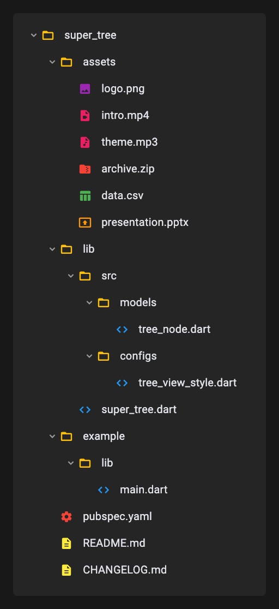
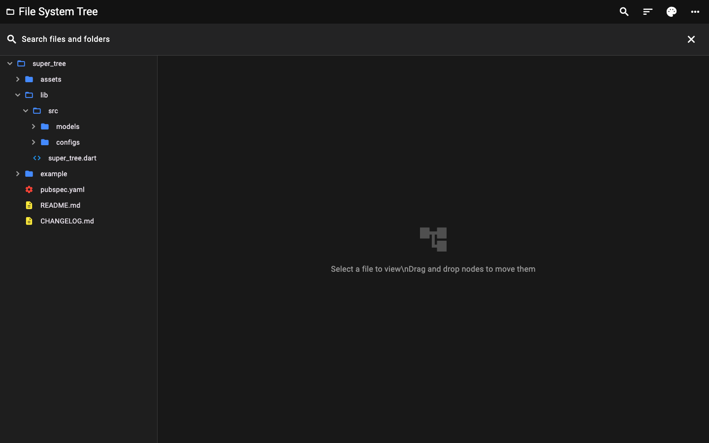
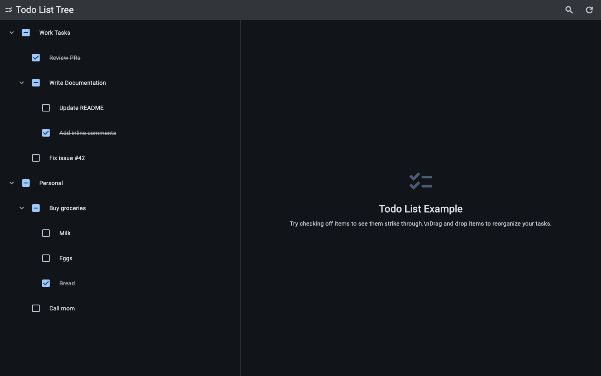

# Super Tree [](https://pub.dev/packages/super_tree) 



A high-performance, fully customizable, and platform-agnostic hierarchical tree view for Flutter.

Build complex tree structures like **File Explorers**, **Todo Lists**, or **Permission Trees** with ease.

### Key Features

- **High Performance**: Flat-list architecture for smooth scrolling.
- **Fully Customizable**: Builders and styling.
- **Desktop and Mobile Ready**: Keyboard nav, context menus, drag-and-drop.
- **State Management**: Optional controller for expansion, selection, updates.
- **Prebuilt Widgets**: Ready-to-use file-system and todo trees.
- **Search and Selection**: Fuzzy search and multi-selection.

### Getting Started

Add `super_tree` to your `pubspec.yaml`:

```yaml
dependencies:
  super_tree: ^0.1.0
```

```sh
flutter pub add super_tree
```

<br clear="right" />

## Usage

### Simple Tree View

Building a tree is as simple as providing a list of nodes:

```dart
import 'package:super_tree/super_tree.dart';

SuperTreeView<String>(
  roots: [
    TreeNode(
      id: 'root',
      data: 'Documents',
      children: [
        TreeNode(id: 'child1', data: 'Resume.pdf'),
        TreeNode(id: 'child2', data: 'Budget.xlsx'),
      ],
    ),
  ],
  prefixBuilder: (context, node) => Icon(
    node.hasChildren ? Icons.folder : Icons.insert_drive_file,
  ),
  contentBuilder: (context, node, renameField) => Text(node.data),
)
```

### Advanced Usage with Controller

For dynamic updates and interaction handling, use the `TreeController`:

```dart
final controller = TreeController<MyData>(
  roots: initialRoots,
  onNodeRenamed: (node, newName) => print('Renamed to $newName'),
);

// Toggle programmatically
controller.expandAll();
controller.addRoot(newNode);
```

### Built-In Fuzzy Filtering

`super_tree` includes reusable fuzzy-search primitives (`TreeSearchController`,
`defaultTreeFuzzyMatcher`) and a composable `FuzzyTreeFilter` helper for
keyword rules and custom matcher hooks.

```dart
final FuzzyTreeFilter<TodoItem> filter = FuzzyTreeFilter<TodoItem>(
  keywordRules: <TreeFilterKeywordRule<TodoItem>>[
    TreeFilterKeywordRule<TodoItem>(
      keywords: <String>{'done', 'completed'},
      predicate: (TreeNode<TodoItem> node) => node.data.isCompleted,
    ),
    TreeFilterKeywordRule<TodoItem>(
      keywords: <String>{'open', 'pending'},
      predicate: (TreeNode<TodoItem> node) => !node.data.isCompleted,
    ),
  ],
);

final TreeSearchController<TodoItem> searchController =
    TreeSearchController<TodoItem>(
      treeController: controller,
      labelProvider: (TodoItem item) => item.title,
      searchMatcher: filter.asSearchMatcher(),
      expansionBehavior: TreeSearchExpansionBehavior.expandAncestors,
    );
```

Behavior notes:
- Empty query: `FuzzyTreeFilter` returns a zero-score empty-highlight match; in normal usage call `searchController.clearSearch()` to restore unfiltered state.
- No match: search keeps the current query active and shows no visible nodes until the query changes or is cleared.
- Extension queries: use `FuzzyTreeFilter.extensionSuffixMatcher` to support terms like `.dart` for file-like trees.

## Examples

Check the [example project](example/lib/main.dart) for comprehensive demonstrations including:

- **File System Explorer**: VS Code style implementation with themes and icons.
- **Todo List**: Hierarchical task management with checkboxes.
- **Checkbox States**: Stateful checkbox behavior and parent-child tree workflows.
- **Responsive Menus**: Adaptive interaction patterns for Mobile and Desktop.

### Preview Gallery

Current in-repo previews (Phase 1):

| Example                       | Preview                                                                                     |
| ----------------------------- | ------------------------------------------------------------------------------------------- |
| File System Explorer + Search |  |
| Todo Tree                     |         |

The screenshot workflow is designed to scale to all examples from `example/lib/main.dart`.

### Capture Workflow (Screenshots + Optional GIFs)

From the repository root:

```bash
# Generate/update preview screenshots (file explorer + todo)
scripts/capture_example_previews.sh

# Copy generated screenshots into the wiki repo image folder
scripts/sync_preview_images_to_wiki.sh

# Optional: convert a recorded video clip to gif
scripts/convert_video_to_gif.sh <input-video> <output-gif> [fps] [width]
```

Notes:
- Screenshot generation uses `flutter test --update-goldens` in `example/test/generate_previews_test.dart`.
- GIF creation is optional and requires `ffmpeg`.
- Canonical screenshot assets are stored in `assets/screenshots/` and committed to the repo.

## Localization

The example app includes Flutter-standard localization setup (`gen_l10n`) with
English and Spanish resources under `example/lib/l10n/`.

- `example/pubspec.yaml` enables localization code generation.
- `example/l10n.yaml` controls ARB input/output.
- `example/lib/main.dart` wires delegates and supported locales.

Use this as a reference integration when adding localized app shells around
`SuperTreeView` in your own projects.

## Contributing

Contributions are welcome! Please feel free to submit a Pull Request or open an issue.

## License

MIT
